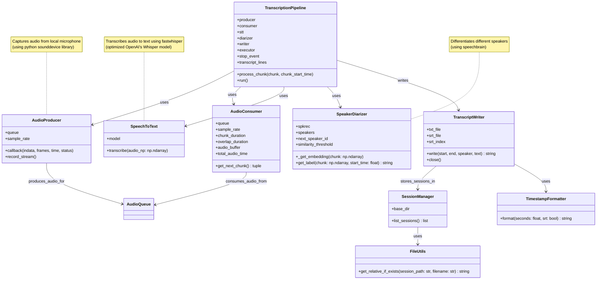

# 🎙️ EchoScribe: Real-Time, Speaker-Aware Meeting Transcripts — No Cloud Needed, On your Local Device, and FREE! 🕒🧑‍🤝‍🧑

> Meet 🎙️ **EchoScribe** — your **free AI-powered** meeting companion! 🚀
It captures conversations 🎤, transcribes them instantly in English 📜, separates each speaker 🧑‍🤝‍🧑, and saves your transcripts in **TXT** or **SRT**. All 100% free, open-source, and runs right on your own device. 💻✨

By feeding your speaker-labeled meeting transcripts to ChatGPT, you unlock powerful insights and productivity boosts:
- **Summarize meetings for everyone** — generate clear, concise summaries for laymen or management.
- **Automatically track action items** — identify tasks discussed and assign responsibilities without manual effort.
- **Spot issues and solutions** — quickly highlight problems raised and the solutions proposed.
- **Get AI-driven guidance** — receive actionable answers for unresolved questions or challenges discussed in the meeting.

---

## 🚀 Features

- 🎧 **Real-time audio capture** from your microphone  
- 📝 **Speech-to-text transcription** using [faster-whisper](https://github.com/guillaumekln/faster-whisper)  
- 🧑‍🤝‍🧑 **Speaker diarization** with [SpeechBrain](https://speechbrain.github.io/)  
- 💾 Automatic saving of transcripts in:
  - **TXT** (readable transcripts)
  - **SRT** (subtitle format with timestamps)  
- 📂 **Session history** with downloadable past transcripts  
- 🌐 Beautiful **Gradio Web UI** + REST API (via FastAPI)

---

## 📦 Installation Guide

#### 🖥️ Test Environment

This program was tested using Python 3.10.16 on an Apple M1 Mac running macOS Ventura 13.7.1.

```bash
python3 --version
# Python 3.10.16

pip3 --version
# pip 23.0.1 from /Users/{your_username}/.pyenv/versions/3.10.16/lib/python3.10/site-packages/pip (python 3.10)

uname -a
# Darwin {your_machine_name} 22.6.0 Darwin Kernel Version 22.6.0: Thu Sep  5 20:47:01 PDT 2024; root:xnu-8796.141.3.708.1~1/RELEASE_ARM64_T6000 arm64

sw_vers
# ProductName:            macOS
# ProductVersion:         13.7.1
# BuildVersion:           22H221

uname -m
# arm64

sysctl -n machdep.cpu.brand_string
# Apple M1 Max
```

#### ⚙️ Installation Steps

```bash
# Clone this repository
git clone https://github.com/tech-magic/echo-scribe.git
cd echo-scribe

# Create your own python virtual environment
python3 -m venv echo-scribe-venv
source echo-scribe-venv/bin/activate

# Install all requirements into the python virtual environment
pip3 install -r requirements.txt

# Run the app from the python virtual environment
python3 app.py
```

Then open your browser at 👉 [http://localhost:7860](http://localhost:7860)

---

## 💻 Web UI Preview

- **Start Recording** ▶️  
- **Stop Recording** ⏹️  
- **Transcript Panel** 📜 – real-time streaming transcript  
- **Past Sessions** 📂 – download **TXT** / **SRT** files

---

## 🏷️ Application Design and Overview

### Utilities

- **TimestampFormatter 🕒**  
  *Formats timestamps to text.*

- **FileUtils 📁**  
  *Handles file path operations.*  
  *Example:* Get relative file paths if they exist in session directories.

### Audio Components

- **AudioProducer 🎤**  
  *Captures audio from the microphone.*  
  *Example:* Records sound and sends it to a queue for processing.

- **AudioConsumer 🎧**  
  *Reads audio chunks from the queue.*  
  *Example:* Processes audio chunks for transcription and speaker detection.

- **AudioQueue 🔄**  
  *Acts as a buffer between producer and consumer.*  
  *Example:* Stores audio chunks temporarily for consumption.

### AI Components

- **SpeechToText 📝**  
  *Transcribes audio to text.*  
  *Example:* Uses FastWhisper to convert speech into readable text.

- **SpeakerDiarizer 🎭**  
  *Differentiates between speakers in audio.*  
  *Example:* Assigns speaker IDs and tracks who is speaking when.

### Recording Components

- **TranscriptWriter 📜**  
  *Writes transcripts to text and SRT files.*  
  *Example:* Generates formatted transcript files with timestamps and speaker labels.

- **SessionManager 🗂️**  
  *Manages session directories and stored files.*  
  *Example:* Keeps track of multiple recording sessions and file organization.

### Coordinator

- **TranscriptionPipeline 🚀**  
  *Orchestrates the whole transcription workflow.*  
  *Example:* Coordinates audio capture, processing, transcription, diarization, and writing.

### Class Diagram



---

## 📂 Session Management

All recordings (during each captured session) are saved under the `data/` directory:

```
data/
 ├── 01-09-2025-20-15-45/
 │   ├── 01-09-2025-20-15-45_transcript.txt
 │   └── 01-09-2025-20-15-45_subtitles.srt
 ├── 01-09-2025-21-00-12/
 │   ├── 01-09-2025-21-00-12_transcript.txt
 │   └── 01-09-2025-21-00-12_subtitles.srt
```

---

## 🔌 API Endpoints

EchoScribe also provides REST endpoints via **FastAPI**:

- **Download transcript/subtitles files:**  
  ```
  GET /data/{session_id}/{filename}
  ```

Example:

```bash
curl http://localhost:7860/data/01-09-2025-20-15-45/01-09-2025-20-15-45_transcript.srt -o 01-09-2025-20-15-45_transcript.srt
```

---

## ⚙️ Tech Stack

- [Gradio](https://www.gradio.app/) – Web UI  
- [FastAPI](https://fastapi.tiangolo.com/) – REST API  
- [faster-whisper](https://github.com/guillaumekln/faster-whisper) – ASR engine  
- [SpeechBrain](https://speechbrain.github.io/) – Speaker recognition  
- [PyTorch](https://pytorch.org/) – Deep learning backend  
- [scikit-learn](https://scikit-learn.org/) – Similarity metrics  

---

## ✨ Further Improvements

- [ ] Multi-language transcription 🌍  
- [ ] Pre-trained speaker labeling (e.g., "Alice", "Bob") 🏷️  


---

## 📜 License

MIT License © 2025

---

Happy **Transcribing**! 🚀